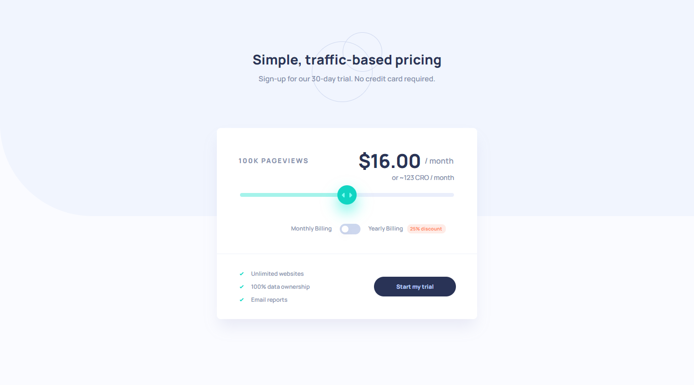
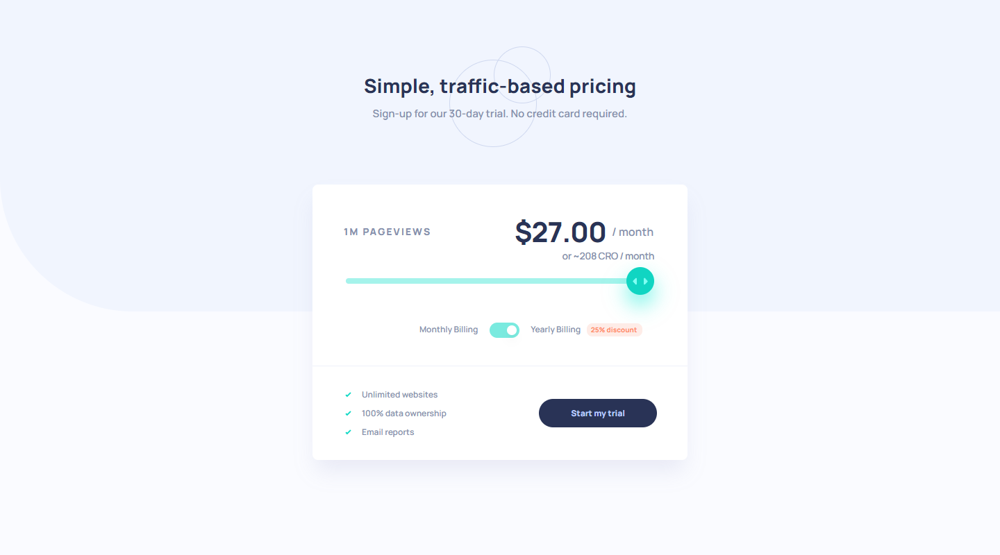

# Cronos Assignment

A showcase website demonstrating front-end development skills for Cronos' assignment.

Visit live site: <https://cronos-assignment.web.app/>

## Assignment

This project follows [these instructions](https://cronos-hq.notion.site/Front-End-Take-home-assignment-1-Responsive-Price-Calculator-9a6ec1a38f5c401c9088f14c0754f251) and is built according to the [design image files](design/).

## Tech Stack

- Build with [React](https://react.dev/) and [TypeScript](https://www.typescriptlang.org/).
- Adopt the [Vitamin](https://github.com/wtchnm/Vitamin) template, which utilizes [Vite](https://vitejs.dev/) as a build tool and incorporates best practices for React projects.
- Ensure code consistency and formatting with [ESLint](https://eslint.org/) and [Prettier](https://prettier.io/), and integrate them into the workflow via [Husky](https://github.com/typicode/husky) and [lint-staged](https://github.com/okonet/lint-staged).
- Utilize [TanStack Query](https://tanstack.com/query) for efficient data fetching, caching, and synchronization.
- Style using the atomic approach with [Tailwind CSS](https://tailwindcss.com/), alongside [clsx](https://github.com/lukeed/clsx) and [tailwind-merge](https://github.com/dcastil/tailwind-merge), to prevent style conflicts and enhance readability.
- Leverage [shadcn/ui](https://ui.shadcn.com/) for ready-to-use components.
- Automate deployment to [Firebase Hosting](https://firebase.google.com/docs/hosting) through [GitHub Actions](https://docs.github.com/en/actions) for continuous integration.
- Adopt an atomic approach to state management with [Jotai](https://jotai.org/).
- Implement self-hosted fonts using [Fontsource](https://fontsource.org/).

## Screenshots

## TODO

- Error handling
